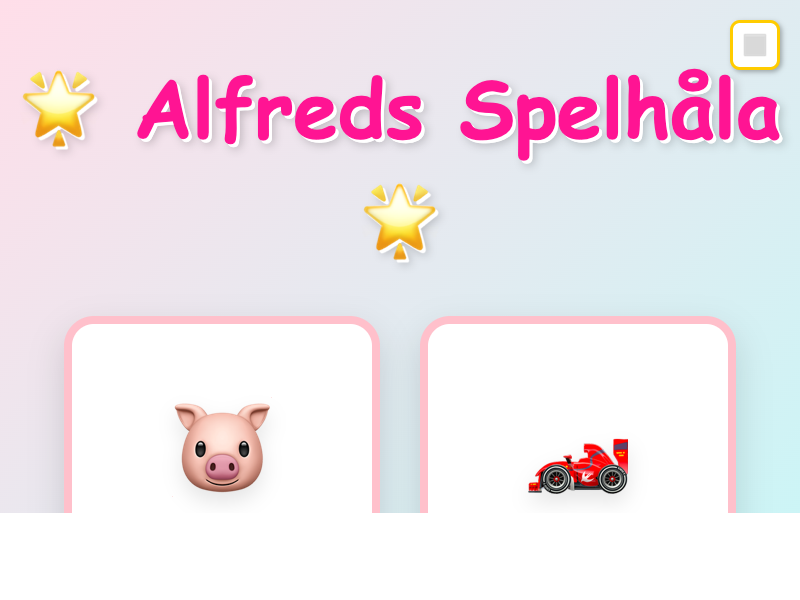
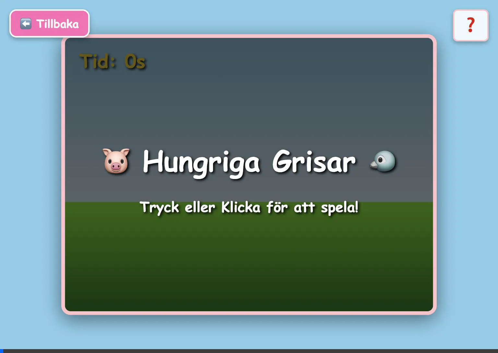
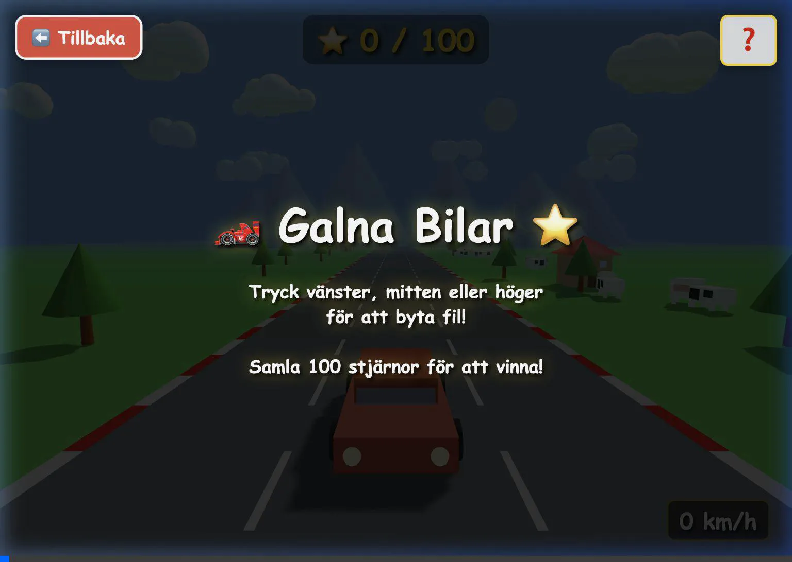
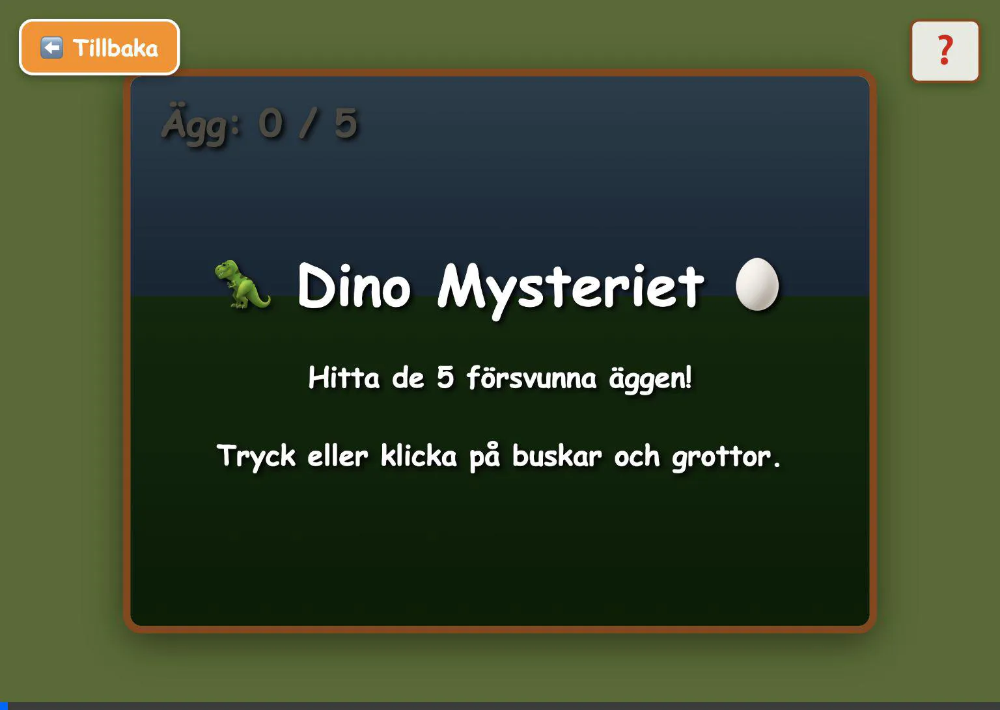
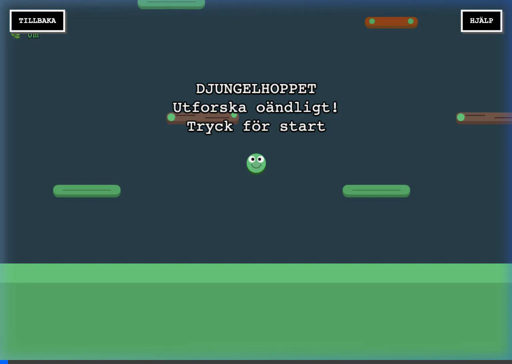
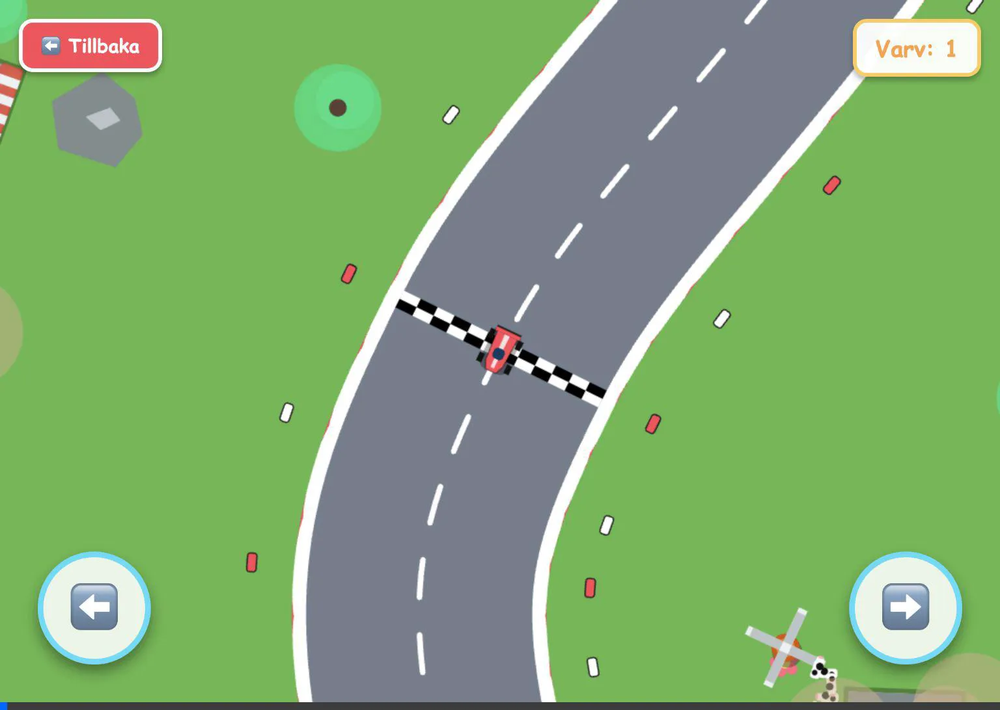
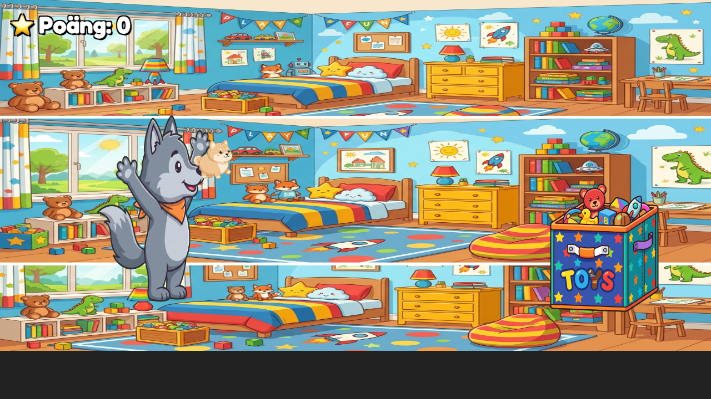

# Alfred's Games (Alfreds Spelhåla)

Welcome to a collection of simple, fun, and child-safe web games designed specifically for a 4-year-old named Alfred. The games are built to be played within a web browser, focusing on touch controls and easy-to-understand gameplay mechanics. Voice-overs using Swedish Text-to-Speech help guide the player.

**🕹️ Play the games here:** [https://home.krogell.se/alfred-spel/](https://home.krogell.se/alfred-spel/)



## Games Included

### 1. Hungry Pigs (Hungriga Grisar) 🐷
A Flappy Bird-style game where you control a flying pig dodging pipes/trees to catch food.



*   **Controls:** Tap anywhere on the screen or press `Space` to jump. Double-tap to duck/dive quickly.
*   **Goal:** Stay in the air as long as possible without hitting obstacles or the ground. 
*   **Tech Stack:** Vanilla JavaScript and HTML5 Canvas (2D).

### 2. Crazy Cars (Galna Bilar) 🏎️
A pseudo-3D perspective racing game. Drive along a winding road, changing lanes to avoid obstacles and collect stars.



*   **Controls:** Tap the left, middle, or right side of the screen to change lanes. You can also use `A`/`D` or the `Arrow` keys. Press `Space` to honk!
*   **Goal:** Collect 100 golden stars to win. Avoid red concrete blocks (they stop the car) and other AI-controlled cars (they will slow you down or you can bump them forward).
*   **Tech Stack:** JavaScript, WebGL using Three.js for full 3D rendering.

### 3. The Dino Mystery (Dino Mysteriet) 🦖
A hidden object game set in a vibrant jungle environment. Help the mother dinosaur find her lost eggs.



*   **Controls:** Tap on bushes, rocks, and caves to search them.
*   **Goal:** Find all 5 hidden eggs. Sometimes you might find a cheeky monkey or a frog instead!
*   **Tech Stack:** Vanilla JavaScript and HTML5 Canvas (2D).

### 4. Jungle Jump (Djungelhoppet) 🐸
A vertical platform-jumping game with a 16-bit aesthetic where you bounce higher and higher to reach the sun!



*   **Controls:** Use `Left`/`Right` arrow keys or touch the sides of the screen to steer left and right. Bounce on leaves, clouds, and bouncepads to go higher!
*   **Goal:** Reach the sun at the top to win. Collect fruits to grow bigger and find invincibility stars. Beware of falling!
*   **Tech Stack:** Vanilla JavaScript and HTML5 Canvas (2D) with infinite level generation and layered backgrounds.

### 5. Super Rally (Super Rally) 🚗
A top-down procedurally generated racing game where cars auto-accelerate and players simply steer through chicanes and AI traffic.



*   **Controls:** Touch the left/right buttons on screen or use the `Left`/`Right` (`A`/`D`) keys to steer.
*   **Goal:** Complete laps around the procedurally generated circuit! Stay on the wide track so you don't lose speed, and bounce off the tires and 8 other diverse AI racers.
*   **Tech Stack:** Vanilla JavaScript and HTML5 Canvas (2D) utilizing Catmull-Rom splines for random track generation.

### 6. Plush Toss (Mjukiskastet) 🐺
A physics-based drag-and-shoot game where you throw a plush toy dog into a toy bin.



*   **Controls:** Drag the dog back with your finger/mouse and release to launch it towards the bin.
*   **Goal:** Successfully score by dropping the plush toy directly into the toy bin and celebrate with confetti.
*   **Tech Stack:** Vanilla JavaScript and HTML5 Canvas (2D) with custom transparency filtering logic.

## How to Run

Since these games use local assets (such as sound effects generated via Web Audio API or textures), they need to be served from a local web server to prevent cross-origin issues in modern web browsers.

1. Open a terminal.
2. Navigate to the project folder.
3. Start a local HTTP server. For example, using Python:
   ```bash
   python3 -m http.server 8080
   ```
4. Open your web browser and navigate to `http://localhost:8080`.

## Caching

Caching has been disabled via `meta` tags in the HTML files to ensure that the latest versions of the games are always loaded during development, which is especially useful when testing on mobile devices (like Android/iOS).

## Fullscreen Mode

A fullscreen button (🔲) is available on the main selection screen (`index.html`) to launch the entire game suite in an immersive viewing mode, preventing accidental screen swipes.

## Development and Contributions

This project uses standard web technologies without external build tools (like Webpack or Node.js) for simplicity, except for the `Three.js` library used in "Galna Bilar" which is fetched via a CDN. 

To edit the games, simply modify the `index.html`, `style.css`, or `game.js` inside the respective game's subfolder and refresh your browser.
